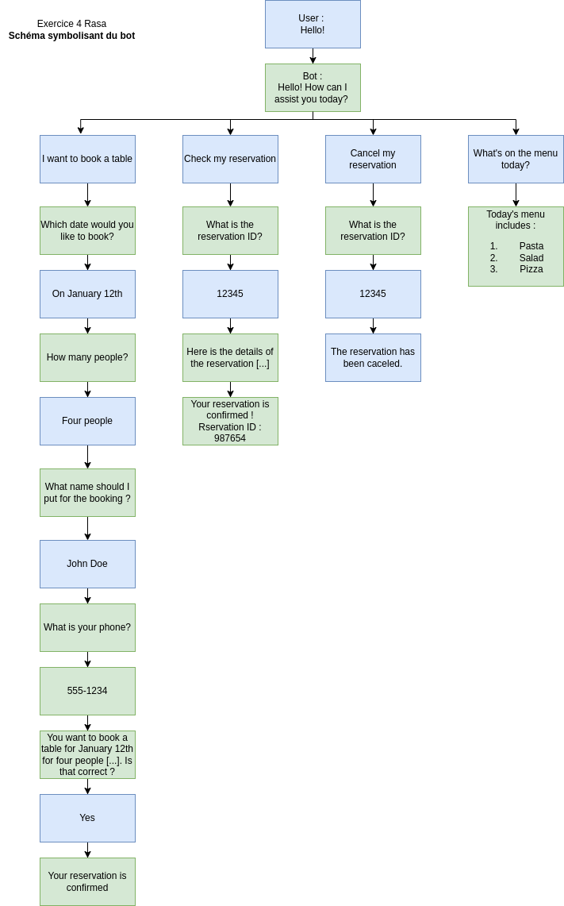
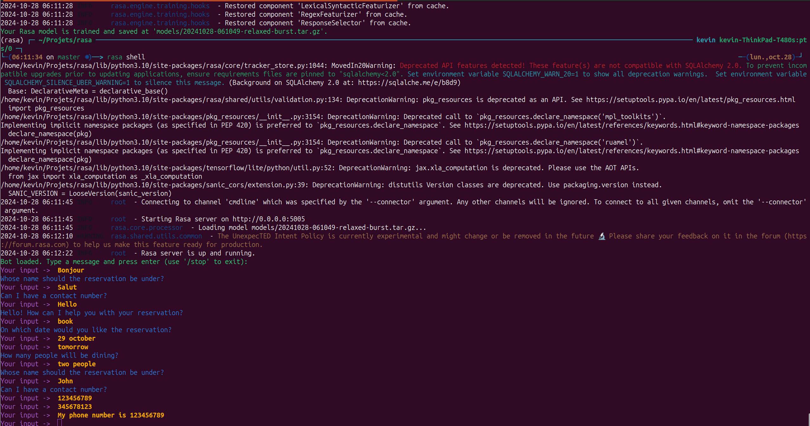

# Restaurant Reservation Bot

Ce projet consiste à créer un bot capable de gérer les réservations pour un restaurant. Voici les fonctionnalités principales du bot :

## Fonctionnalités

- **Réserver une table** : Permet de réserver une table en fournissant les informations suivantes :
    - Date de réservation
    - Nombre de personnes
    - Nom de réservation
    - Numéro de téléphone

- **Vérifier la disponibilité** : Vérifie si une table est disponible pour la date et le nombre de personnes spécifiés.

- **Obtenir un numéro de réservation** : Génère et fournit un numéro de réservation unique.

- **Ajouter un commentaire à la réservation** : Permet d'ajouter des commentaires spécifiques à une réservation.

- **Annuler une réservation** : Permet d'annuler une réservation existante.

- **Afficher les informations de réservation et modifier le commentaire** : Affiche les détails d'une réservation et permet de modifier le commentaire associé.

- **Obtenir le menu du jour** : Fournit le menu du jour du restaurant.


## Schéma du parcours et des stories

Un schéma symbolisant le parcours utilisateur et les différentes stories du bot sera fourni pour illustrer le fonctionnement global du bot.


## Résultat final


## Installation

1. Clonez le dépôt :
     ```bash
     git clone <URL_DU_DEPOT>
     ```

2. Lancez le bot :
     ```bash
     rasa run
     ```
     ou
     ```bash
     rasa train
     # dans un autre onglet
     rasa run actions

     rasa shell
     ```